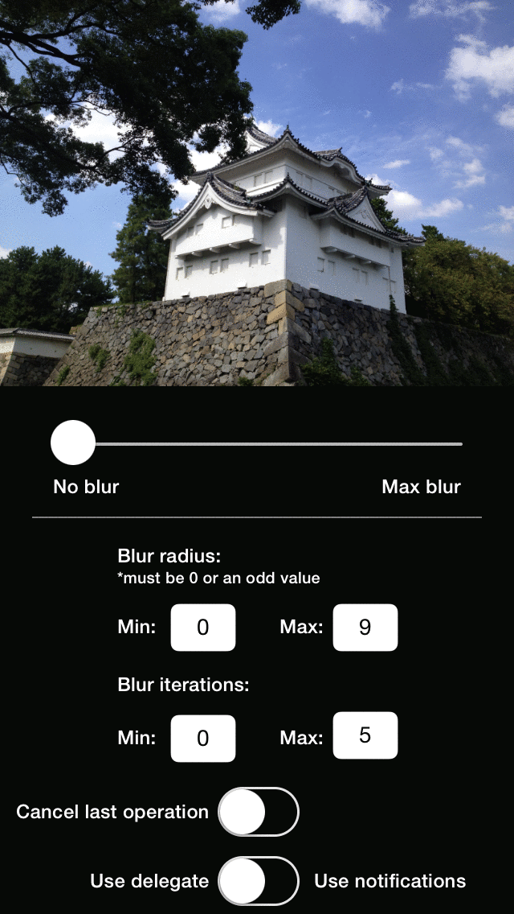

# BlurImageProcessor

[](http://cocoadocs.org/docsets/BlurImageProcessor)
[](http://cocoadocs.org/docsets/BlurImageProcessor)

<p align="center">
    
</p>

**BlurImageProcessor** offers a very easy and practical way to generate blurred images in real time. After an image
is specified to be targeted by it, every new blur operation will create a new allocated image. Varying the value of 
radiuses and iterations, its possible to create many different results and even animations.

Blur operations can be synchronous or asynchronous. Synchronous operations run on the thread/operation queue from which they were called. Each ```ALDBlurImageProcessor``` object has its own processing queue to run asynchronous operations, so it is easy to manage them. Besides that, all delegate callbacks and notifications are called/fired on the main thread, so there's no need to worry about using the new blurred images passed as parameters directly into the user interface.

**BlurImageProcessor** tries to achieve a good balance between memory and performance. It also listens to 
```UIApplicationDidReceiveMemoryWarningNotification``` notifications to clean temporary internal buffers on low memory conditions.

## Usage

First of all, you need to instantiate a processor with a **strong** reference to it, passing the target image you want to blur:

```objc
#import "ALDViewController.h"

@interface MyViewController ()
{
    ALDBlurImageProcessor *blurImageProcessor;
    UIImageView *blurTargetImageView;
}
@end

@implementation MyViewController
-( void )viewDidLoad
{
    ...
    blurImageProcessor = [[ALDBlurImageProcessor alloc] initWithImage: blurTargetImageView.image];
    ...
}
@end
```

Then you choose how you want to handle the generated images: via **blocks**, via its **delegate** or via **notifications**. 

### Blocks

```objc
-( void )viewDidLoad
{
    ...
    [blurImageProcessor asyncBlurWithRadius: 5 
                                 iterations: 7
                               successBlock: ^(UIImage *)blurredImage {
                                   blurTargetImageView.image = blurredImage;
                               }
                               errorBlock: ^(NSNumber *errorCode) {
                                   NSLog(@"Error code: %d", [errorCode intValue]);
                               }];
    ...
}
```

That's all!

### ALDBlurImageProcessorDelegate

Declare you are implementing `ALDBlurImageProcessorDelegate`:

```objc
@interface MyViewController () <ALDBlurImageProcessorDelegate>
{
    ALDBlurImageProcessor *blurImageProcessor;
    UIImageView *blurTargetImageView;
}
@end
```

Then set `blurImageProcessor`'s delegate:

```objc
-( void )viewDidLoad
{
    ...
    blurImageProcessor.delegate = self;
    [blurImageProcessor asyncBlurWithRadius: 5 iterations: 7];
    ...
}
```

And finally implement its methods:

```obj
-( void )onALDBlurImageProcessor:( ALDBlurImageProcessor * )blurImageProcessor newBlurrredImage:( UIImage * )image
{
    blurTargetImageView.image = image;
}

-( void )onALDBlurImageProcessor:( ALDBlurImageProcessor * )blurImageProcessor blurProcessingErrorCode:( NSNumber * )errorCode
{
    NSLog( @"%@", errorCode );
}
```

### NSNotificationCenter

Using **notifications**, just observe the notifications you want:

```objc
-( void )viewDidLoad
{
    ...
    [[NSNotificationCenter defaultCenter] addObserver: self
                                             selector: @selector( onNewBlurredImage: )
                                                 name: ALDBlurImageProcessorImageReadyNotification
                                               object: nil];
    
    [[NSNotificationCenter defaultCenter] addObserver: self
                                             selector: @selector( onBlurImageProcessorError: )
                                                 name: ALDBlurImageProcessorImageProcessingErrorNotification
                                               object: nil];
                                               
    [blurImageProcessor asyncBlurWithRadius: 5 iterations: 7];
    ...
}
```

And implement the methods to handle the blurred image:

```objc
-( void )onNewBlurredImage:( NSNotification * )notification
{
    UIImage *image = notification.userInfo[ ALDBlurImageProcessorImageReadyNotificationBlurrredImageKey ];
    blurTargetImageView.image = image;
}

-( void )onBlurImageProcessorError:( NSNotification * )notification
{
    NSNumber *errorCode = notification.userInfo[ ALDBlurImageProcessorImageProcessingErrorNotificationErrorCodeKey ];
    NSLog( @"%@", errorCode );
}
```

Do not forget to remove the observers you've set:

```objc
-( void )dealloc
{
    [[NSNotificationCenter defaultCenter] removeObserver: self
                                                    name: ALDBlurImageProcessorImageReadyNotification
                                                  object: nil];
    
    [[NSNotificationCenter defaultCenter] removeObserver: self
                                                    name: ALDBlurImageProcessorImageProcessingErrorNotification
                                                  object: nil];
}

```


## Requirements

iOS 6.0 or higher

## Installation

BlurImageProcessor is available through [CocoaPods](http://cocoapods.org), to install
it simply add the following line to your Podfile:

```ruby
pod "BlurImageProcessor"
```

## Author

- [Daniel L. Alves](http://github.com/danielalves) ([@alveslopesdan](https://twitter.com/alveslopesdan))

## Collaborators

- [Gustavo Barbosa](http://github.com/barbosa) ([@gustavocsb](https://twitter.com/gustavocsb))

## License

BlurImageProcessor is available under the MIT license. See the LICENSE file for more info.

